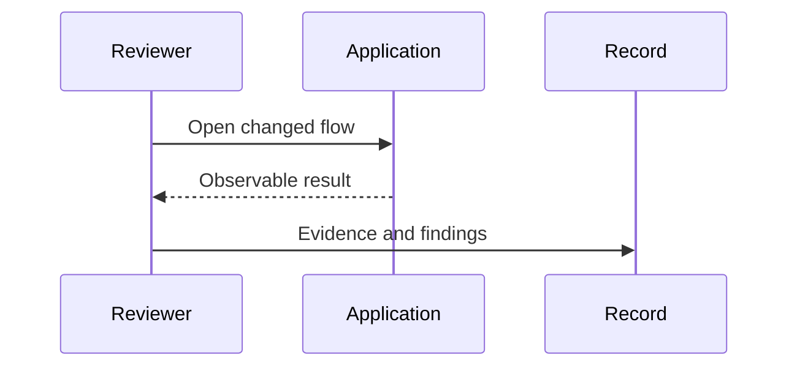

## Acceptance review

This synthetic review sibling demonstrates composition and diagram rendering.

```mermaid
sequenceDiagram
  accTitle: Review the launched flow
  accDescr: The reviewer opens the feature and compares the result with acceptance.
  Reviewer->>Application: Open changed flow
  Application-->>Reviewer: Observable result
  Reviewer->>Record: Evidence and findings
```
